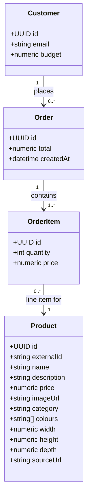

# Data Model

This describes the information the app needs to remember, based on what
we've built so far: a logged-in customer browses a product catalogue and
places orders that get checked against their budget.

It maps directly onto the four tables already created in
[supabase/schema.sql](./supabase/schema.sql): `profiles`, `products`,
`orders`, `order_items`.

## Diagram

## Plain English

**Customer** is a shopper. Created automatically the moment someone signs
up (in the code: `profiles`, one row per user). It holds their email and
their `budget` — the total they're allowed to spend, starting at $1000.
We don't store a running "amount left" — that's always calculated by
subtracting the total of all their past orders from this number, so it
can never drift out of sync.

**Product** is one item in the furniture catalogue — a sofa, a lamp, a
bookshelf. It holds a name, description, price, a photo, a category (e.g.
"Sofas & armchairs"), and a few physical details (colours, width, height,
depth) carried over from the source catalogue. `externalId` and `sourceUrl`
trace each row back to where it came from — see "Where the catalogue data
comes from" below. Products aren't owned by any one customer — everyone
browsing the shop sees the same list.

**Order** is created the moment a customer places an order — it's the
receipt. It remembers who placed it (via its link to Customer), the total
amount charged, and when it happened. A customer can have many orders over
time, but each order belongs to exactly one customer.

**OrderItem** is a single line on that receipt — "2x Bar Stool". An order
usually contains more than one product, so each product-and-quantity pair
in a single order gets its own OrderItem row, all linked back to the same
Order. Each OrderItem also links to the Product it refers to, so we know
*what* was bought.

**Why OrderItem stores its own `price` instead of looking it up from
Product:** product prices can change later (a sofa might go on sale next
month), but a receipt shouldn't change with it. Capturing the price at the
moment of purchase means old orders always show what the customer actually
paid, even if the catalogue price moves afterward.

**Why budget lives on Customer rather than being spread across orders:**
it's a single, simple cap that's checked against the sum of everything a
customer has ever ordered — one number to reason about, rather than
tracking a shrinking balance that has to be carefully decremented (and
could get out of sync if something failed halfway through).

## Where the catalogue data comes from

`products` is loaded from a MongoDB collection provided for the hackathon
(762 IKEA-style furniture items), via `scripts/sync-products.mjs` — see
[CLAUDE.md](./CLAUDE.md#catalogue-data-source) for how that script works.
`externalId` is that source's own item ID, kept so the script can be re-run
safely: it updates existing rows by `externalId` instead of creating
duplicates. Product photos are uploaded to a public Supabase Storage bucket
(`product-images`); `image_url` just holds the resulting URL. (Earlier
version of this script stored the image bytes as base64 text directly in
`image_url` — simpler, but with 762 products averaging ~120KB of image
data each, a `select *` on `products` — which the home page runs on every
load — grew large/slow enough to hit Postgres's statement timeout. Moving
to Storage was the fix.)
